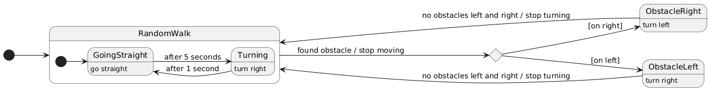

# Report

## 1. Phototaxis

### General idea
The robot detects light on light sensors 1 and 24.

The robot should care only about the direction in which the light is detected and not its intensity. A way to do this is detecting the minimum and maximum light on all the sensor and mapping the sensed light on sensors 1 and 24 from 0 to 1 based on the minimum and maximum light.

The average of the two sensor is computed since the center front direction is between the two.

The robot compares the light level detected by the two sensors and steers in order to make them equalize. (Turning always in the same direction if no light is detected in both sensors)

The robot should turn faster when going in a completely wrong direction, and slower when going the right direction (also avoiding zig-zag). So the correction (amount of steer) is linearly adjusted based on how much the average of the two sensors is distant from 1 (exactly in front) in order to make small corrections if the difference is small and higher corrections if it's high.

### Extra light?
Adding another light source introduce unpredictable behavior about the "choice" of which light to follow.

### Sensor noise?
Adding a sensor nose of 0.1 (pretty high) proved that the controller algorithm is quite resilient.

The experienced behavior is that the robot makes strange adjustments but still tends to reach the light source.

## 2. Random walk with collision avoidance

### General idea
The robot moves randomly until he detects an obstacle on his front-right or front-left side.

When an obstacle is detected the robot stops moving and starts turning to the opposite side until there's no more obstacles on either sides, and goes back to the random moving behavior.

### Formalization
Here is the state diagram of the controller:

### Why stops moving
Stop moving between state changes is an implementation detail. It's needed as without it the robot will keep moving according to the current state for one step more, which may cause unpredictable behavior.

### Why stops turning when there are no obstacle on either sides
The first version of the controller stopped turning when there was no obstacle on the side where it was detected first, but this resulted in the robot being stuck turning left and right in front of obstacles.

Stop turning when no obstacle is detected on either sides solve this problem by fixing the turn direction until the way is free of obstacles.

### Multiple robots?
I've tried to instantiate multiple robot which caused no unexpected behavior.

### Sensors noise?
Adding sensor noise caused an immediate problem as the robots starts rotating endlessly.

The reason is that no treshold was set with respect to detecting obstacles, and so even a small noise would cause the robot to detect obstacles everywhere at any time.

## 3. Food for thought
- **What does exactly mean to “Program the robot such that it is able to perform phototaxis”? Is the task correctly, properly and completely defined?**

  Multiple things are not specified, for example if the robot should stop when reaching the spot nearest to the light or what should it do when multiple light sources are present.

- **ˆObstacle avoidance: to what extent are we sure to avoid any kind of collision? How can we attain a safe wandering? Did you experience situations in which the robot gets stuck? If so, what might be done to avoid them?**

  The robot might get stuck in the sense that there are possible environmental conditions that cause a loop in its behavior.
  
- **ˆWhat are the main difficulties in each of the robot programming exercises?**

  The hardest things were dealing with noised sensors, strange placing of sensors on the robot.

- **Which of the two tasks between phototaxis and obstacle avoidance is harder to program? Why?**

  I'd say the second exercise was harder since it was implemented with some kind of memory.

- **Does the controller need memory to let the robot achieve the desired task? If yes,why? If not, would it help?**

  In both the exercises memory can provide an ehancement:
  - In phototaxi it could be useful to choose a single target light source
  - In the second exercize it was useful to remember in which direction to continue turning.

- **ˆHow would you assess the performance of the robot?**
  
  In the first exercise we could take into account the amount of time needed to get near (threshold to be set) the light or the length of the path followed.

  In the second exercise one of the most important things is to avoid the robot getting stuck, so we could look for repeated behavior.
