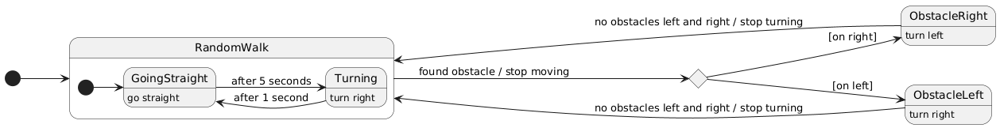

# Report

## 1. Phototaxis

### General idea
The robot detects light on light sensors 1 and 24.

It compares the light level detected by the two sensors and steers in order to make them equalize. (Turning always in the same direction if no light is detected in both sensors)

We want the robot to turn faster when going in a completely wrong direction, and slower when going the right direction (also avoiding zig-zag). So the correction is linearly adjusted based on the difference in order to make small corrections if the difference is small and higher corrections if it's high.

This way of computing the correction works well only if we take into account the direction of the light and not its intensity. A way to do this is detecting the minimum and maximum light on all the sensor and mapping the sensed light on sensors 1 and 24 from 0 to 1 based on the minimum and maximum light.

### Extra light?
Adding another light source introduce unpredictable behavior about the "choice" of which light to follow.

### Sensor noise?
Adding a sensor nose of 0.1 (pretty high) proved that the controller algorithm is quite resilient.

The experienced behavior is that the robot makes strange adjustments but still tends to reach the light source.

## 2. Random walk with collision avoidance

### General idea
The robot moves randomly until he detects an obstacle on his front-right or front-left side.

When an obstacle is detected the robot stops moving and starts turning to the opposite side until there's no more obstacles on either sides, and goes back to the random moving behavior.

### Formalization
Here is the state diagram of the controller:

### Why stops moving
Stop moving between state changes is an implementation detail. It's needed as without it the robot will keep moving according to the current state for one step more, which may cause unpredictable behavior.

### Why stops turning when there are no obstacle on either sides
The first version of the controller stopped turning when there was no obstacle on the side where it was detected first, but this resulted in the robot being stuck turning left and right in front of obstacles.

Stop turning when no obstacle is detected on either sides solve this problem by fixing the turn direction until the way is free of obstacles.

### Multiple robots?
I've tried to instantiate multiple robot which caused no unexpected behavior.

### Sensors noise?
Adding sensor noise caused an immediate problem as the robots starts rotating endlessly.

The reason is that no treshold was set with respect to detecting obstacles, and so even a small noise would cause the robot to detect obstacles everywhere at any time.
